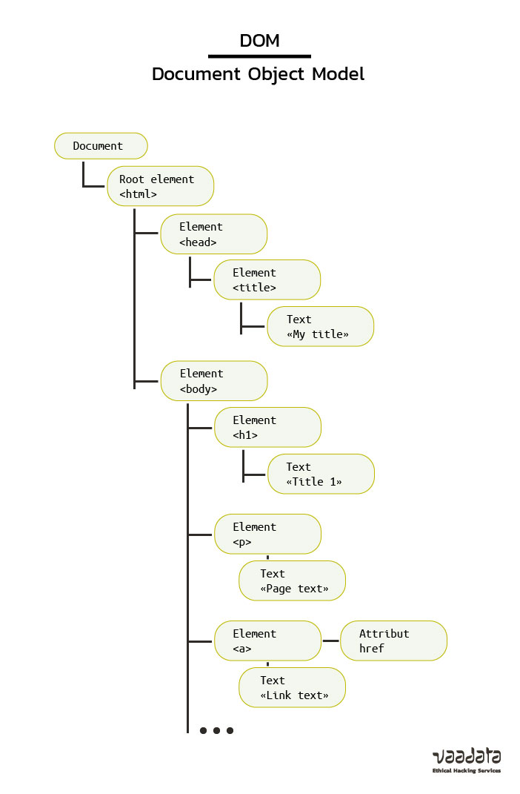
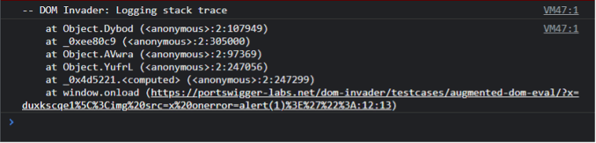

<h1>DOM-based XSS</h1>

    Avant de parler de cela  ,  parle d'abord du DOM  ; C'est quoi le DOM ?

le DOM (Document Object Model) est une interface programmation d'application
pour fichier HTML et XML. En effet il est represente sous forme d'arbre , et subdivise en plusieurs noeuds , facilitant le modification du contenu d'un navigateur web (page web)
a travers des script javascript. Il permet a javascript de recuperer les evenements utilisateurs (des click , de la saisie , chargement de page...)

    Par exple :
        const input = document.getElementById("son id").innerHTML

## Ici on recupere la valeur de l'objet du DOM qui a pour id : "son id"

        Document Object model

<h1>Comment Identifier et exploiter le DOM-based XSS ?</h1>

La premiere Methode est simple  , il suffira juste d'inspecter le code js de la page , 
afin de verifier si  il n'y a pas des variables dont la valeur est controle par l'utilisateur. Par exple : on pourrait avoir  une variable qui recupere le nom de l'utilisateur qu'il saisira dans  un Input. Apres donc avoir inspecter et trouver des sources potentiel ,  il va donc falloir determine ou ce situe cette source et la cerner (determine a quel niveau du DOM elle interviens ,  et quel valeur elle recupere.)
Pour ce faire nous  pouvons utiliser la console du navigateur afin d'obtenir la valeur de la source, et ensuite une fois que nous avons bien saisi le paramètre que l’on contrôle il faut cerner  ou est ce que  il se trouve dans le DOM. Pour cela, nous faisons une recherche du terme mis en entrée sous l’onglet « Sources ». Cette analyse va nous permettre de comprendre échapper l’objet courant du DOM pour exécuter du code.

Cette premiere methode n'est vraiment  utilise que si le code Javascript n'est pas mimifie
(taille du code reduite  , et difficile a lire), ce qui n'est pas toujours le cas en pentesting web.

<h2>Détecter les failles DOM-based XSS avec DOM Invader</h2>

Si vous êtes un utilisateur de Burp, vous pouvez utiliser DOM Invader. C’est une extension préinstallée dans le navigateur intégré de Burp. Elle rend la détection des DOM XSS plus facile et plus rapide. Il y a deux fonctionnalités majeures :
    
    - La vision du DOM où l’on peut identifier toutes les sources contrôlables et les sinks de façon instantanée. Il est aussi très simple de retrouver où la charge utile est injectée dans le code côté client.

    - La vision des Web Message (ou postMessage) qui permet de capturer, éditer et rejouer tous les web message qui passent par la page.

La première de ces deux fonctionnalités est la plus importante pour détecter une DOM-based XSS classique. L’extension est capable d’injecter une chaine de caractère défini par l’utilisateur dans toutes les sources possibles ou seulement dans l’URL. Elle va ensuite signaler les sources et les sinks où cette chaine de caractère se retrouve. Le plus de l’extension est que les caractères « ‘ « <> » sont ajoutés à la chaine injectée pour savoir s’ils sont échappés ou encodés. Le second grand avantage de l’extension est que l’on a accès à la stack trace dans la console du navigateur.

Nous voyons directement où notre chaine de caractère se retrouve dans le code en cliquant simplement sur le lien dans la console (comme le montre l’image ci-dessus). Cette extension est d’une grande aide pour réussir à exploiter les DOM-based XSS.

<h2>Identifier les DOM XSS via de l’analyse statique de code</h2>

Une bonne pratique est de faire de l’analyse statique de code (le fait d’inspecter le code source de façon automatique). Des librairies peuvent être utilisées à ce sujet, ce sont des linters. Eslint est un bon exemple de ce genre de librairie. Mozilla a développé un plug-in Eslint pour identifier les DOM-based XSS.

Son utilisation est très efficace pour corriger les vulnérabilités, car les endroits dangereux dans le code seront détectés plus précisément qu’une recherche de chaine de caractères. Une revue manuelle est ensuite nécessaire pour confirmer si le code est vulnérable ou non.

<h1>Quelques techniques de protection</h1>

<h1>Comment se protéger d’une vulnérabilité DOM-based XSS ?</h1>

- utiliser textContent quand l’utilisation de HTML n’est pas nécessaire et encoder les entrées utilisateurs avec une fonction de ce type :

## function htmlEncode(str){
##  return String(str).replace(/[^\w. ]/gi, function(c){
##     return '&#'+c.charCodeAt(0)+';';
##  });

- Eviter les sources controle par l'utilisateur. Au cas ou une fonctionnalite l'oblige alors une validation cote client devra etre mise en place en utilisant des whiteList afin d'autorise  seulement du contenu de confiance.

- Une autre solution est d’assainir les données. Pour ce faire, Mozilla a par exemple conçu une API : Sanitizer API.

- les Trusted Types sont un autre moyen de se protéger contre des DOM XSS